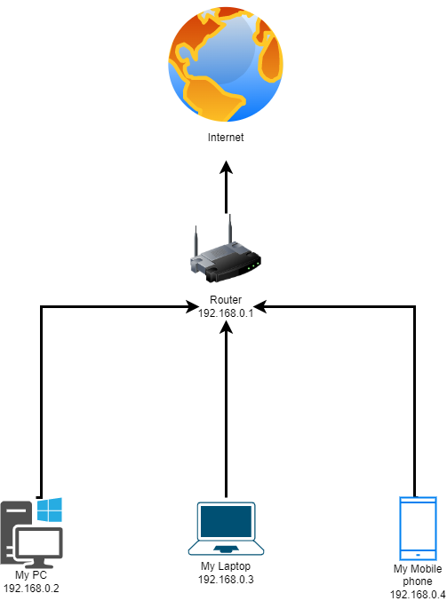

###### 1. Подключитесь к публичному маршрутизатору в интернет. Найдите маршрут к вашему публичному IP
    ```
    telnet route-views.routeviews.org
    Username: rviews
    show ip route 37.145.211.161/32
    show bgp 37.145.211.161/32
    ```
    
    route-views>show ip route 37.145.211.161
    Routing entry for 37.144.0.0/14
    Known via "bgp 6447", distance 20, metric 0
    Tag 6939, type external
    Last update from 64.71.137.241 04:38:16 ago
    Routing Descriptor Blocks:
    * 64.71.137.241, from 64.71.137.241, 04:38:16 ago
      Route metric is 0, traffic share count is 1
      AS Hops 3
      Route tag 6939
      MPLS label: none

    route-views>show bgp 37.145.211.161
    BGP routing table entry for 37.144.0.0/14, version 1397084195
    Paths: (24 available, best #10, table default)
      Not advertised to any peer
      Refresh Epoch 1
      4901 6079 3356 8402 8402
        162.250.137.254 from 162.250.137.254 (162.250.137.254)
          Origin IGP, localpref 100, valid, external
          Community: 65000:10100 65000:10300 65000:10400
          path 7FE05226B508 RPKI State not found
          rx pathid: 0, tx pathid: 0
      Refresh Epoch 3
      3303 3216 8402
        217.192.89.50 from 217.192.89.50 (138.187.128.158)
          Origin IGP, localpref 100, valid, external
          Community: 3216:1000 3216:1004 3216:1110 3216:2221 3216:5000 3216:5010 3216:5020 3216:5030 3216:5040 3216:5101 3216:5310 3216:5320 3216:5400 3216:5410 3303:1004 3303:1006 3303:1030 3303:3056 8402:900 8402:904
          path 7FE18905FC68 RPKI State not found
          rx pathid: 0, tx pathid: 0
      Refresh Epoch 1
      7660 2516 1273 8402 8402 8402
        203.181.248.168 from 203.181.248.168 (203.181.248.168)
          Origin IGP, localpref 100, valid, external
          Community: 2516:1030 7660:9003
          path 7FE1111AB050 RPKI State not found
          rx pathid: 0, tx pathid: 0
      Refresh Epoch 1
      3267 3356 8402 8402
        194.85.40.15 from 194.85.40.15 (185.141.126.1)
          Origin IGP, metric 0, localpref 100, valid, external
    
###### 2. Создайте dummy0 интерфейс в Ubuntu. Добавьте несколько статических маршрутов. Проверьте таблицу маршрутизации.
    sudo ip link add dummy0 type dummy
    sudo nano /etc/network/interfaces
    auto dummy0
    iface dummy0 inet static
    address 192.168.1.150
    netmask 255.255.255.0
    
    vagrant@vagrant:~$ ifconfig
    dummy0: flags=195<UP,BROADCAST,RUNNING,NOARP>  mtu 1500
            inet 192.168.1.150  netmask 255.255.255.0  broadcast 192.168.1.255
            inet6 fe80::bc3e:25ff:fe5c:9142  prefixlen 64  scopeid 0x20<link>
            ether be:3e:25:5c:91:42  txqueuelen 1000  (Ethernet)
            RX packets 0  bytes 0 (0.0 B)
            RX errors 0  dropped 0  overruns 0  frame 0
            TX packets 7  bytes 490 (490.0 B)
            TX errors 0  dropped 0 overruns 0  carrier 0  collisions 0
    
    sudo ip route add 172.16.10.0/24 via 192.168.1.150
    sudo ip route add 192.168.10.0/24 via 10.0.2.15
    
    vagrant@vagrant:~$ ip route
    default via 10.0.2.2 dev eth0 proto dhcp src 10.0.2.15 metric 100
    10.0.2.0/24 dev eth0 proto kernel scope link src 10.0.2.15
    10.0.2.2 dev eth0 proto dhcp scope link src 10.0.2.15 metric 100
    172.16.10.0/24 via 192.168.1.150 dev dummy0
    192.168.1.0/24 dev dummy0 proto kernel scope link src 192.168.1.150
    192.168.3.0/24 dev eth0.100 proto kernel scope link src 192.168.3.200
    192.168.10.0/24 via 10.0.2.15 dev eth0


###### 3. Проверьте открытые TCP порты в Ubuntu, какие протоколы и приложения используют эти порты? Приведите несколько примеров.
    vagrant@vagrant:~$ sudo ss -ltnp
    State  Recv-Q Send-Q   Local Address:Port   Peer Address:Port  Process
    LISTEN 0      4096           0.0.0.0:111         0.0.0.0:*     users:(("rpcbind",pid=664,fd=4),("systemd",pid=1,fd=35))
    LISTEN 0      4096     127.0.0.53%lo:53          0.0.0.0:*     users:(("systemd-resolve",pid=665,fd=13))
    LISTEN 0      128            0.0.0.0:22          0.0.0.0:*     users:(("sshd",pid=867,fd=3))
    LISTEN 0      4096              [::]:111            [::]:*     users:(("rpcbind",pid=664,fd=6),("systemd",pid=1,fd=37))
    LISTEN 0      128               [::]:22             [::]:*     users:(("sshd",pid=867,fd=4))

    port 22 - ssh
    port 53 - dns
    
   
###### 4. Проверьте используемые UDP сокеты в Ubuntu, какие протоколы и приложения используют эти порты?
    vagrant@vagrant:~$ sudo ss -lunp
    State  Recv-Q Send-Q   Local Address:Port   Peer Address:Port Process
    UNCONN 0      0        127.0.0.53%lo:53          0.0.0.0:*     users:(("systemd-resolve",pid=665,fd=12))
    UNCONN 0      0       10.0.2.15%eth0:68          0.0.0.0:*     users:(("systemd-network",pid=416,fd=19))
    UNCONN 0      0              0.0.0.0:111         0.0.0.0:*     users:(("rpcbind",pid=664,fd=5),("systemd",pid=1,fd=36))
    UNCONN 0      0                 [::]:111            [::]:*     users:(("rpcbind",pid=664,fd=7),("systemd",pid=1,fd=38))
    
    port 53 - dns (systemd-resolve)
    port 68 - systemd.network — Network configuration
###### 5. Используя diagrams.net, создайте L3 диаграмму вашей домашней сети или любой другой сети, с которой вы работали.


