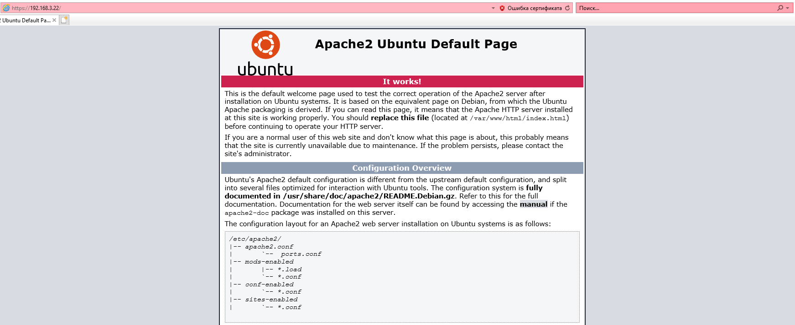
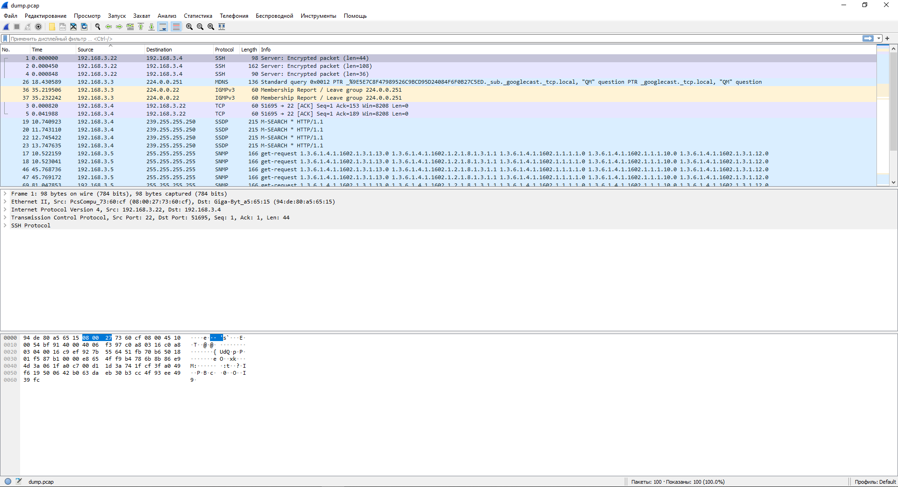

###### 1. Установите Bitwarden плагин для браузера. Зарегестрируйтесь и сохраните несколько паролей.
    Готово.

###### 2. Установите Google authenticator на мобильный телефон. Настройте вход в Bitwarden акаунт через Google authenticator OTP.
    Готово.

###### 3. Установите apache2, сгенерируйте самоподписанный сертификат, настройте тестовый сайт для работы по HTTPS.
Подготовка и установка:

    vagrant@vagrant:~$ sudo apt-get update
    vagrant@vagrant:~$ sudo apt-get install apache2

Проверка:

    vagrant@vagrant:~$ sudo systemctl status apache2
    ● apache2.service - The Apache HTTP Server
         Loaded: loaded (/lib/systemd/system/apache2.service; enabled; vendor preset: enabled)
         Active: active (running) since Tue 2021-12-07 17:10:26 UTC; 2min 19s ago
           Docs: https://httpd.apache.org/docs/2.4/
       Main PID: 3191 (apache2)
          Tasks: 55 (limit: 1071)
         Memory: 5.6M
         CGroup: /system.slice/apache2.service
                 ├─3191 /usr/sbin/apache2 -k start
                 ├─3192 /usr/sbin/apache2 -k start
                 └─3193 /usr/sbin/apache2 -k start
    
    Dec 07 17:10:26 vagrant systemd[1]: Starting The Apache HTTP Server...
    Dec 07 17:10:26 vagrant systemd[1]: Started The Apache HTTP Server.

Генерация самоподписанного SSL сертификата:

    vagrant@vagrant:~$ sudo openssl req -x509 -nodes -days 365 -newkey rsa:2048 -keyout /etc/ssl/private/apache-selfsigned.key -out /etc/ssl/certs/apache-selfsigned.crt
    Generating a RSA private key
    
Внесение изменений в default-ssl.conf

    vagrant@vagrant:/etc/ssl$ sudo nano /etc/apache2/sites-available/default-ssl.conf
Добавить:
    
    ServerName 192.168.3.22 - (ip адрес виртуальной машины linux в домашней сети).
    
    SSLCertificateFile      /etc/ssl/certs/apache-selfsigned.crt
    SSLCertificateKeyFile /etc/ssl/private/apache-selfsigned.key
    
Внесение изменений в 000-default.conf (настройка перенаправления с http на https)
    
    vagrant@vagrant:/etc/ssl$ sudo nano /etc/apache2/sites-available/000-default.conf

    Redirect "/" "https://192.168.3.22/"

Активация изменений в Apache:

    vagrant@vagrant:/etc/ssl$ sudo a2enmod ssl
    Considering dependency setenvif for ssl:
    Module setenvif already enabled
    Considering dependency mime for ssl:
    Module mime already enabled
    Considering dependency socache_shmcb for ssl:
    Module socache_shmcb already enabled
    Module ssl already enabled
    vagrant@vagrant:/etc/ssl$ sudo a2enconf ssl-params
    Conf ssl-params already enabled
    vagrant@vagrant:/etc/ssl$ sudo apache2ctl configtest
    Syntax OK
    vagrant@vagrant:/etc/ssl$ sudo systemctl restart apache2

Теперь при открытии страницы 192.168.3.22 с другого устройства в той же сети будет появляться предупреждение что сайт не защищен (это нормально, так как созданный сертификат ни кем не подписан). Нужно нажать "Перейти на веб-страницу".
Откроется тестовая страница сервиса apache по протоколу https (редирект с http также работает)

    
    

###### 4. Проверьте на TLS уязвимости произвольный сайт в интернете.
    vagrant@vagrant:~/testssl.sh$ ./testssl.sh -p yandex.ru

    ###########################################################
        testssl.sh       3.1dev from https://testssl.sh/dev/
        (0eb73d9 2021-12-07 08:55:54 -- )
    
          This program is free software. Distribution and
                 modification under GPLv2 permitted.
          USAGE w/o ANY WARRANTY. USE IT AT YOUR OWN RISK!
    
           Please file bugs @ https://testssl.sh/bugs/
    
    ###########################################################
    
     Using "OpenSSL 1.0.2-chacha (1.0.2k-dev)" [~183 ciphers]
     on vagrant:./bin/openssl.Linux.x86_64
     (built: "Jan 18 17:12:17 2019", platform: "linux-x86_64")
    
    
    Testing all IPv4 addresses (port 443): 5.255.255.88 77.88.55.77 77.88.55.88 5.255.255.80
    --------------------------------------------------------------------------------
     Start 2021-12-07 18:58:04        -->> 5.255.255.88:443 (yandex.ru) <<--
    
     Further IP addresses:   5.255.255.80 77.88.55.88 77.88.55.77 2a02:6b8:a::a
     rDNS (5.255.255.88):    yandex.ru.
     Service detected:       HTTP
    
    
     Testing protocols via sockets except NPN+ALPN
    
     SSLv2      not offered (OK)
     SSLv3      not offered (OK)
     TLS 1      offered (deprecated)
     TLS 1.1    offered (deprecated)
     TLS 1.2    offered (OK)
     TLS 1.3    offered (OK): final
     NPN/SPDY   not offered
     ALPN/HTTP2 h2, http/1.1 (offered)
    
    
     Done 2021-12-07 18:58:09 [   8s] -->> 5.255.255.88:443 (yandex.ru) <<--
    
    --------------------------------------------------------------------------------
     Start 2021-12-07 18:58:09        -->> 77.88.55.77:443 (yandex.ru) <<--
    
     Further IP addresses:   5.255.255.80 77.88.55.88 5.255.255.88 2a02:6b8:a::a
     rDNS (77.88.55.77):     yandex.ru.
     Service detected:       HTTP
    
    
     Testing protocols via sockets except NPN+ALPN
    
     SSLv2      not offered (OK)
     SSLv3      not offered (OK)
     TLS 1      offered (deprecated)
     TLS 1.1    offered (deprecated)
     TLS 1.2    offered (OK)
     TLS 1.3    offered (OK): final
     NPN/SPDY   not offered
     ALPN/HTTP2 h2, http/1.1 (offered)
    
    
     Done 2021-12-07 18:58:15 [  14s] -->> 77.88.55.77:443 (yandex.ru) <<--
    
    --------------------------------------------------------------------------------
     Start 2021-12-07 18:58:15        -->> 77.88.55.88:443 (yandex.ru) <<--
    
     Further IP addresses:   5.255.255.80 77.88.55.77 5.255.255.88 2a02:6b8:a::a
     rDNS (77.88.55.88):     yandex.ru.
     Service detected:       HTTP
    
    
     Testing protocols via sockets except NPN+ALPN
    
     SSLv2      not offered (OK)
     SSLv3      not offered (OK)
     TLS 1      offered (deprecated)
     TLS 1.1    offered (deprecated)
     TLS 1.2    offered (OK)
     TLS 1.3    offered (OK): final
     NPN/SPDY   not offered
     ALPN/HTTP2 h2, http/1.1 (offered)
    
    
     Done 2021-12-07 18:58:20 [  19s] -->> 77.88.55.88:443 (yandex.ru) <<--
    
    --------------------------------------------------------------------------------
     Start 2021-12-07 18:58:20        -->> 5.255.255.80:443 (yandex.ru) <<--
    
     Further IP addresses:   77.88.55.88 77.88.55.77 5.255.255.88 2a02:6b8:a::a
     rDNS (5.255.255.80):    yandex.ru.
     Service detected:       HTTP
    
    
     Testing protocols via sockets except NPN+ALPN
    
     SSLv2      not offered (OK)
     SSLv3      not offered (OK)
     TLS 1      offered (deprecated)
     TLS 1.1    offered (deprecated)
     TLS 1.2    offered (OK)
     TLS 1.3    offered (OK): final
     NPN/SPDY   not offered
     ALPN/HTTP2 h2, http/1.1 (offered)
    
    
     Done 2021-12-07 18:58:26 [  25s] -->> 5.255.255.80:443 (yandex.ru) <<--

--------------------------------------------------------------------------------
    Done testing now all IP addresses (on port 443): 5.255.255.88 77.88.55.77 77.88.55.88 5.255.255.80

###### 5. Установите на Ubuntu ssh сервер, сгенерируйте новый приватный ключ. Скопируйте свой публичный ключ на другой сервер. Подключитесь к серверу по SSH-ключу.
Подготовка:
    
    systemctl start sshd.service
    sudo systemctl start sshd.service
Генерация ключа на клиенте:
   
    ssh-keygen

Копирование содержимого publickey на сервер (publickey будет добавлен в файл ~/.ssh/authorized_keys):
    
    ssh-copy-id vagrant@192.168.3.22
    sudo nano sshd_config
    
Отключение авторизации по паролю на сервере:
    
    sudo nano cd /etc/ssh/sshd_config
    Раскомментировать строку:
    PasswordAuthentication no
    
Подключение по ssh будет происходить без запроса логина и пароля:

    ssh vagrant@192.168.3.22

###### 6. Переименуйте файлы ключей из задания 5. Настройте файл конфигурации SSH клиента, так чтобы вход на удаленный сервер осуществлялся по имени сервера.
На клиенте:
    
    mv id_rsa.pub client_id_rsa.pub | mv id_rsa client_id_rsa

На сервере:
    
    mv id_rsa.pub server_id_rsa.pub | mv id_rsa server_id_rsa

Настройка клиента:

    /etc/ssh$ sudo nano ssh_config
    Добавить:
    Host vagrant
        HostName 192.168.3.22
    
Подключение по имени:

    ssh vagrant

###### 7. Соберите дамп трафика утилитой tcpdump в формате pcap, 100 пакетов. Откройте файл pcap в Wireshark.
    vagrant@vagrant:~$ sudo tcpdump -c 100 -i eth0 -w dump.pcap
