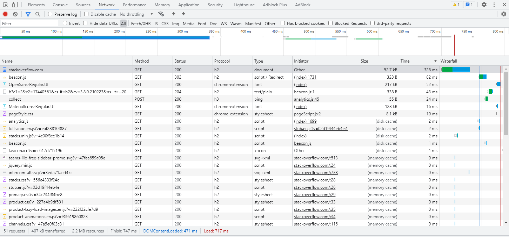

###### 1. Работа c HTTP через телнет.
- Подключитесь утилитой телнет к сайту stackoverflow.com
`telnet stackoverflow.com 80`
- отправьте HTTP запрос
```bash
GET /questions HTTP/1.0
HOST: stackoverflow.com
[press enter]
[press enter]
```
###### - В ответе укажите полученный HTTP код, что он означает?
    
    HTTP/1.1 301 Moved Permanently - для запрашиваемой страницы настроено постоянное перенаправление (redirect). 
    
###### 2. Повторите задание 1 в браузере, используя консоль разработчика F12.
- откройте вкладку `Network`
- отправьте запрос http://stackoverflow.com
- найдите первый ответ HTTP сервера, откройте вкладку `Headers`
- укажите в ответе полученный HTTP код.
- проверьте время загрузки страницы, какой запрос обрабатывался дольше всего?
- приложите скриншот консоли браузера в ответ.
######
    Status Code: 200 - успешный ответ.
    Дольше всего обрабатывался запрос stackoverflow.com - 328 ms

###### 3. Какой IP адрес у вас в интернете?
    37.145.211.161 
###### 4. Какому провайдеру принадлежит ваш IP адрес? Какой автономной системе AS? Воспользуйтесь утилитой `whois`
    Провайдер:
    descr: RU-BEELINE-BROADBAND-POOL2
    AS:
    origin: AS8402
    source: RIPE # Filtered
###### 5. Через какие сети проходит пакет, отправленный с вашего компьютера на адрес 8.8.8.8? Через какие AS? Воспользуйтесь утилитой `traceroute`
    vagrant@vagrant:~$ traceroute -An 8.8.8.8
    traceroute to 8.8.8.8 (8.8.8.8), 30 hops max, 60 byte packets
     1  192.168.0.1 [AS65190]  0.503 ms  0.455 ms  0.662 ms
     2  100.123.0.1 [*]  1.407 ms  1.530 ms  1.395 ms
     3  * * *
     4  * * *
     5  85.21.224.191 [AS8402]  2.480 ms  2.428 ms *
     6  * 108.170.250.34 [AS15169]  2.417 ms 108.170.250.66 [AS15169]  2.805 ms
     7  * * 172.253.66.116 [AS15169]  18.979 ms
     8  108.170.250.33 [AS15169]  4.180 ms 172.253.65.82 [AS15169]  19.171 ms 209.85.254.6 [AS15169]  17.801 ms
     9  172.253.66.116 [AS15169]  19.478 ms  19.402 ms 108.170.250.51 [AS15169]  3.405 ms
    10  * * *
    11  142.250.209.161 [AS15169]  19.577 ms 172.253.64.53 [AS15169]  19.556 ms 216.239.42.21 [AS15169]  19.079 ms
    12  216.239.63.25 [AS15169]  20.812 ms * *
    13  * * *
    14  * * *
    15  * * *
    16  * * *
    17  * * *
    18  * 8.8.8.8 [AS15169]  21.160 ms *
    
    192.168.0.1 - моя сеть (роутер).
    100.123.0.1 - Internet Assigned Numbers Authority
    85.21.224.191 [AS8402] - CORBINA TELECOM Network Operations
    [AS15169] - Google LLC

###### 6. Повторите задание 5 в утилите `mtr`. На каком участке наибольшая задержка - delay?
    vagrant@vagrant:~$ mtr -zn 8.8.8.8
                                                     My traceroute  [v0.93]
    vagrant (192.168.1.22)                                                                         2021-11-28T10:03:32+0000
    Keys:  Help   Display mode   Restart statistics   Order of fields   quit
                                                                               Packets               Pings
    Host                                                                        Loss%   Snt   Last   Avg  Best  Wrst StDev
    1. AS???    192.168.1.1                                                      0.0%     6    0.4   0.5   0.4   0.6   0.1
    2. AS???    100.123.0.1                                                      0.0%     6    2.0   1.4   1.2   2.0   0.3
    3. (waiting for reply)
    4. (waiting for reply)
    5. AS8402   85.21.224.191                                                    0.0%     6    2.7   2.2   1.6   2.9   0.6
    6. AS15169  108.170.250.146                                                  0.0%     6    2.7   2.4   2.0   2.7   0.3
    7. AS15169  209.85.249.158                                                  20.0%     6   16.9  17.7  16.8  20.1   1.6
    8. AS15169  216.239.57.222                                                   0.0%     6   20.5  21.0  20.1  23.5   1.2
    9. AS15169  142.250.210.47                                                   0.0%     6   20.1  20.5  19.9  21.2   0.5
    10. (waiting for reply)
    11. (waiting for reply)
    12. (waiting for reply)
    13. (waiting for reply)
    14. (waiting for reply)
    15. (waiting for reply)
    16. (waiting for reply)
    17. (waiting for reply)
    18. (waiting for reply)
    19. AS15169  8.8.8.8                                                         20.0%     5   17.2  19.3  17.2  20.8   1.5

    Max delay - 8. AS15169  216.239.57.222 
###### 7. Какие DNS сервера отвечают за доменное имя dns.google? Какие A записи? воспользуйтесь утилитой `dig`
    vagrant@vagrant:~$ dig +trace dns.google

    ; <<>> DiG 9.16.1-Ubuntu <<>> +trace dns.google
    ;; global options: +cmd
    .                       7085    IN      NS      c.root-servers.net.
    .                       7085    IN      NS      b.root-servers.net.
    .                       7085    IN      NS      a.root-servers.net.
    .                       7085    IN      NS      m.root-servers.net.
    .                       7085    IN      NS      l.root-servers.net.
    .                       7085    IN      NS      k.root-servers.net.
    .                       7085    IN      NS      j.root-servers.net.
    .                       7085    IN      NS      i.root-servers.net.
    .                       7085    IN      NS      h.root-servers.net.
    .                       7085    IN      NS      g.root-servers.net.
    .                       7085    IN      NS      f.root-servers.net.
    .                       7085    IN      NS      e.root-servers.net.
    .                       7085    IN      NS      d.root-servers.net.
    ;; Received 262 bytes from 127.0.0.53#53(127.0.0.53) in 0 ms
    
    google.                 172800  IN      NS      ns-tld1.charlestonroadregistry.com.
    google.                 172800  IN      NS      ns-tld2.charlestonroadregistry.com.
    google.                 172800  IN      NS      ns-tld3.charlestonroadregistry.com.
    google.                 172800  IN      NS      ns-tld4.charlestonroadregistry.com.
    google.                 172800  IN      NS      ns-tld5.charlestonroadregistry.com.
    google.                 86400   IN      DS      6125 8 2 80F8B78D23107153578BAD3800E9543500474E5C30C29698B40A3DB2 3ED9DA9F
    google.                 86400   IN      RRSIG   DS 8 1 86400 20211211050000 20211128040000 14748 . Xx2CliouKZIwfh3OBun5FzWtz+X5CE80cxMqXuAiRKjonb+lpef9WkMd /FbvA55XeCyDA2IIUvn+0o3T/JZLy5R09twaYYaQgD3r6hOQwTdOyE47 W/wh6VuLq9Ur7bOmyfVirxz2ixQBLv1qIjg2zD4kqjMY0UmJDH6IcQSt 8mOeoeWMjdstYC9JBr2ICl4OhXgLe4+JS1LdRjN4+yBVQkIDRZ6UzU4Y Hi5B3bfOiqGuB8Y6WJ/tGh9gXfxjLFEG+P58dSPNAr8n2anCs42yTYFe HeJm1/7Vlxx0KmgbKPxoqN3NY4Hse3fc56IZVkj/YHmDpUyuw2mTshpO /dC+uA==
    ;; Received 730 bytes from 199.7.83.42#53(l.root-servers.net) in 68 ms
    
    dns.google.             10800   IN      NS      ns4.zdns.google.
    dns.google.             10800   IN      NS      ns3.zdns.google.
    dns.google.             10800   IN      NS      ns1.zdns.google.
    dns.google.             10800   IN      NS      ns2.zdns.google.
    dns.google.             3600    IN      DS      56044 8 2 1B0A7E90AA6B1AC65AA5B573EFC44ABF6CB2559444251B997103D2E4 0C351B08
    dns.google.             3600    IN      RRSIG   DS 8 2 3600 20211218041030 20211126041030 8830 google. y06iadlZq+YDX22qoVF/fIvOxIZQq7UsCcBKpJSAlrd8T9VSh67pMFRF q7pAae+aKrUKtLwtWMQT8abUECNpfFkpMztXWK46s11zpg+ldibsh/uk zt4bDHttv4T6mE0PQWqoY2OePi0wvI9ta4rd9amEh5kRPtp4/2c21Vs8 aSo=
    ;; Received 506 bytes from 216.239.36.105#53(ns-tld3.charlestonroadregistry.com) in 20 ms
    
    dns.google.             900     IN      A       8.8.8.8
    dns.google.             900     IN      A       8.8.4.4
    dns.google.             900     IN      RRSIG   A 8 2 900 20211228081142 20211128081142 1773 dns.google. iaWGMOFKAJc1J6o4yORtobdDAtn2nYtO8KYKsyQwMao47cTOrvEZe6cB 8zYjC/VLrJS6Jo2+leWAdb2axwOrUo82hrF+/OrSrYKE4WTbrPaDtKFC TYoq+3RNJVVyhEWR0WzhRuHbxxUGYVXkEfHWL+y296zFP/WJQDkM8KN2 kjs=
    ;; Received 241 bytes from 216.239.32.114#53(ns1.zdns.google) in 48 ms
    
##### DNS Сервера:
    dns.google.             10800   IN      NS      ns4.zdns.google.
    dns.google.             10800   IN      NS      ns3.zdns.google.
    dns.google.             10800   IN      NS      ns1.zdns.google.
    dns.google.             10800   IN      NS      ns2.zdns.google.
    
##### A записи:
    dns.google.             900     IN      A       8.8.8.8
    dns.google.             900     IN      A       8.8.4.4
###### 8. Проверьте PTR записи для IP адресов из задания 7. Какое доменное имя привязано к IP? воспользуйтесь утилитой `dig`

###### Доменное имя dns.google.
    vagrant@vagrant:~$ dig -x 8.8.8.8

    ; <<>> DiG 9.16.1-Ubuntu <<>> -x 8.8.8.8
    ;; global options: +cmd
    ;; Got answer:
    ;; ->>HEADER<<- opcode: QUERY, status: NOERROR, id: 2256
    ;; flags: qr rd ra; QUERY: 1, ANSWER: 1, AUTHORITY: 0, ADDITIONAL: 1
    
    ;; OPT PSEUDOSECTION:
    ; EDNS: version: 0, flags:; udp: 65494
    ;; QUESTION SECTION:
    ;8.8.8.8.in-addr.arpa.          IN      PTR
    
    ;; ANSWER SECTION:
    8.8.8.8.in-addr.arpa.   4839    IN      PTR     dns.google.
    
    ;; Query time: 0 msec
    ;; SERVER: 127.0.0.53#53(127.0.0.53)
    ;; WHEN: Sun Nov 28 10:27:08 UTC 2021
    ;; MSG SIZE  rcvd: 73
    
    vagrant@vagrant:~$ dig -x 8.8.4.4
    
    ; <<>> DiG 9.16.1-Ubuntu <<>> -x 8.8.4.4
    ;; global options: +cmd
    ;; Got answer:
    ;; ->>HEADER<<- opcode: QUERY, status: NOERROR, id: 43798
    ;; flags: qr rd ra; QUERY: 1, ANSWER: 1, AUTHORITY: 0, ADDITIONAL: 1
    
    ;; OPT PSEUDOSECTION:
    ; EDNS: version: 0, flags:; udp: 65494
    ;; QUESTION SECTION:
    ;4.4.8.8.in-addr.arpa.          IN      PTR
    
    ;; ANSWER SECTION:
    4.4.8.8.in-addr.arpa.   77831   IN      PTR     dns.google.
    
    ;; Query time: 4 msec
    ;; SERVER: 127.0.0.53#53(127.0.0.53)
    ;; WHEN: Sun Nov 28 10:27:22 UTC 2021
    ;; MSG SIZE  rcvd: 73