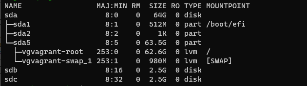

# Домашнее задание к занятию "3.5. Файловые системы"

###### 1. Узнайте о [sparse](https://ru.wikipedia.org/wiki/%D0%A0%D0%B0%D0%B7%D1%80%D0%B5%D0%B6%D1%91%D0%BD%D0%BD%D1%8B%D0%B9_%D1%84%D0%B0%D0%B9%D0%BB) (разряженных) файлах.
    С материалом ознакомился, в том числе и на habr.com. Практическое приминение пока придумать сложно.
###### 2. Могут ли файлы, являющиеся жесткой ссылкой на один объект, иметь разные права доступа и владельца? Почему?
    Создал тестовый файл и hard link для него.
        vagrant@vagrant:~$ touch test_file
        vagrant@vagrant:~$ ln test_file1 hl_tf1
        vagrant@vagrant:~$ stat --format=%h test_file1
        2
    У основного файла и файла, который ссылается через hard link на основной файл один и тот же Inod. 
        vagrant@vagrant:~$ ls -li
        total 0
        131088 -rw-rw-r-- 2 vagrant vagrant 0 Nov 24 18:29 test_file1
        131088 -rw-rw-r-- 2 vagrant vagrant 0 Nov 24 18:29 hl_tf1
    Проверка текущих прав доступа и владельцев файлов:
        vagrant@vagrant:~$ stat test_file1 | grep Uid
        Access: (0664/-rw-rw-r--)  Uid: ( 1000/ vagrant)   Gid: ( 1000/ vagrant)
        vagrant@vagrant:~$ stat hl_tf1 | grep Uid
        Access: (0664/-rw-rw-r--)  Uid: ( 1000/ vagrant)   Gid: ( 1000/ vagrant)
    Смена владельца test_file1 на root. Файл hl_tf1 также сменил владельца.
        vagrant@vagrant:~$ sudo chown root test_file1
        vagrant@vagrant:~$ stat test_file1 | grep Uid
        Access: (0664/-rw-rw-r--)  Uid: (    0/    root)   Gid: ( 1000/ vagrant)
        vagrant@vagrant:~$ stat hl_tf1 | grep Uid
        Access: (0664/-rw-rw-r--)  Uid: (    0/    root)   Gid: ( 1000/ vagrant)
    Попытка изменить права доступа только для test_file1:
        vagrant@vagrant:~$ sudo chmod a+x test_file1
        vagrant@vagrant:~$ stat hl_tf1 | grep Uid
        Access: (0775/-rwxrwxr-x)  Uid: (    0/    root)   Gid: ( 1000/ vagrant)
        vagrant@vagrant:~$ stat test_file1 | grep Uid
        Access: (0775/-rwxrwxr-x)  Uid: (    0/    root)   Gid: ( 1000/ vagrant)
    Итого: права доступа изменились и для test_file1 и для hl_tf1, значит дело в Inode этих файлов, а точнее одного файла и hard link на него.
###### 3. Сделайте `vagrant destroy` на имеющийся инстанс Ubuntu. Замените содержимое Vagrantfile следующим:
    
    ```bash
    Vagrant.configure("2") do |config|
      config.vm.box = "bento/ubuntu-20.04"
      config.vm.provider :virtualbox do |vb|
        lvm_experiments_disk0_path = "/tmp/lvm_experiments_disk0.vmdk"
        lvm_experiments_disk1_path = "/tmp/lvm_experiments_disk1.vmdk"
        vb.customize ['createmedium', '--filename', lvm_experiments_disk0_path, '--size', 2560]
        vb.customize ['createmedium', '--filename', lvm_experiments_disk1_path, '--size', 2560]
        vb.customize ['storageattach', :id, '--storagectl', 'SATA Controller', '--port', 1, '--device', 0, '--type', 'hdd', '--medium', lvm_experiments_disk0_path]
        vb.customize ['storageattach', :id, '--storagectl', 'SATA Controller', '--port', 2, '--device', 0, '--type', 'hdd', '--medium', lvm_experiments_disk1_path]
      end
    end
    ```

###### Данная конфигурация создаст новую виртуальную машину с двумя дополнительными неразмеченными дисками по 2.5 Гб.
    Готово.
    

###### 4. Используя `fdisk`, разбейте первый диск на 2 раздела: 2 Гб, оставшееся пространство.
    До начала разбивки диска:
    vagrant@vagrant:~$ lsblk
        NAME                 MAJ:MIN RM  SIZE RO TYPE MOUNTPOINT
        sda                    8:0    0   64G  0 disk
        ├─sda1                 8:1    0  512M  0 part /boot/efi
        ├─sda2                 8:2    0    1K  0 part
        └─sda5                 8:5    0 63.5G  0 part
          ├─vgvagrant-root   253:0    0 62.6G  0 lvm  /
          └─vgvagrant-swap_1 253:1    0  980M  0 lvm  [SWAP]
        sdb                    8:16   0  2.5G  0 disk
        sdc                    8:32   0  2.5G  0 disk
    Разбивка диска.
    vagrant@vagrant:~$ sudo fdisk /dev/sdb
    Command (m for help): p
    Disk /dev/sdb: 2.51 GiB, 2684354560 bytes, 5242880 sectors
    Disk model: VBOX HARDDISK
    Units: sectors of 1 * 512 = 512 bytes
    Sector size (logical/physical): 512 bytes / 512 bytes
    I/O size (minimum/optimal): 512 bytes / 512 bytes
    Disklabel type: dos
    Disk identifier: 0x4e7dc841
    
    Command (m for help): n
    Partition type
       p   primary (0 primary, 0 extended, 4 free)
       e   extended (container for logical partitions)
    Select (default p): p
    Partition number (1-4, default 1): 1
    First sector (2048-5242879, default 2048): 2048
    Last sector, +/-sectors or +/-size{K,M,G,T,P} (2048-5242879, default 5242879): +2G
    
    Created a new partition 1 of type 'Linux' and of size 2 GiB.
    
    Command (m for help): n
    Partition type
       p   primary (1 primary, 0 extended, 3 free)
       e   extended (container for logical partitions)
    Select (default p): p
    Partition number (2-4, default 2): 2
    First sector (4196352-5242879, default 4196352): 4196352
    Last sector, +/-sectors or +/-size{K,M,G,T,P} (4196352-5242879, default 5242879): 5242879
    
    Created a new partition 2 of type 'Linux' and of size 511 MiB.
    
    Command (m for help): w
    The partition table has been altered.
    Calling ioctl() to re-read partition table.
    Syncing disks.
    
###### Проверка результата:
    vagrant@vagrant:~$ lsblk
    NAME                 MAJ:MIN RM  SIZE RO TYPE MOUNTPOINT
    sda                    8:0    0   64G  0 disk
    ├─sda1                 8:1    0  512M  0 part /boot/efi
    ├─sda2                 8:2    0    1K  0 part
    └─sda5                 8:5    0 63.5G  0 part
      ├─vgvagrant-root   253:0    0 62.6G  0 lvm  /
      └─vgvagrant-swap_1 253:1    0  980M  0 lvm  [SWAP]
    sdb                    8:16   0  2.5G  0 disk
    ├─sdb1                 8:17   0    2G  0 part
    └─sdb2                 8:18   0  511M  0 part
    sdc                    8:32   0  2.5G  0 disk

###### 5. Используя `sfdisk`, перенесите данную таблицу разделов на второй диск.
    vagrant@vagrant:~$ sfdisk -d /dev/sdb | sfdisk --force /dev/sdc
    
    Результат:
    vagrant@vagrant:~$ lsblk
    NAME                 MAJ:MIN RM  SIZE RO TYPE MOUNTPOINT
    sda                    8:0    0   64G  0 disk
    ├─sda1                 8:1    0  512M  0 part /boot/efi
    ├─sda2                 8:2    0    1K  0 part
    └─sda5                 8:5    0 63.5G  0 part
      ├─vgvagrant-root   253:0    0 62.6G  0 lvm  /
      └─vgvagrant-swap_1 253:1    0  980M  0 lvm  [SWAP]
    sdb                    8:16   0  2.5G  0 disk
    ├─sdb1                 8:17   0    2G  0 part
    └─sdb2                 8:18   0  511M  0 part
    sdc                    8:32   0  2.5G  0 disk
    ├─sdc1                 8:33   0    2G  0 part
    └─sdc2                 8:34   0  511M  0 part

###### 6. Соберите `mdadm` RAID1 на паре разделов 2 Гб.
    vagrant@vagrant:~$ sudo mdadm --create --verbose /dev/md/raid1 -l 1 -n 2 /dev/sd{b1,c1}
    mdadm: Note: this array has metadata at the start and
        may not be suitable as a boot device.  If you plan to
        store '/boot' on this device please ensure that
        your boot-loader understands md/v1.x metadata, or use
        --metadata=0.90
    mdadm: size set to 2094080K
    Continue creating array? y
    mdadm: Defaulting to version 1.2 metadata
    mdadm: array /dev/md/raid1 started.

    Результат:
    vagrant@vagrant:~$ lsblk
    NAME                 MAJ:MIN RM  SIZE RO TYPE  MOUNTPOINT
    sda                    8:0    0   64G  0 disk
    ├─sda1                 8:1    0  512M  0 part  /boot/efi
    ├─sda2                 8:2    0    1K  0 part
    └─sda5                 8:5    0 63.5G  0 part
      ├─vgvagrant-root   253:0    0 62.6G  0 lvm   /
      └─vgvagrant-swap_1 253:1    0  980M  0 lvm   [SWAP]
    sdb                    8:16   0  2.5G  0 disk
    ├─sdb1                 8:17   0    2G  0 part
    │ └─md127              9:127  0    2G  0 raid1
    └─sdb2                 8:18   0  511M  0 part
    sdc                    8:32   0  2.5G  0 disk
    ├─sdc1                 8:33   0    2G  0 part
    │ └─md127              9:127  0    2G  0 raid1
    └─sdc2                 8:34   0  511M  0 part

###### 7. Соберите `mdadm` RAID0 на второй паре маленьких разделов.
    vagrant@vagrant:~$ sudo mdadm --create --verbose /dev/md/raid0 -l 0 -n 2 /dev/sd{b2,c2}
    mdadm: chunk size defaults to 512K
    mdadm: Defaulting to version 1.2 metadata
    mdadm: array /dev/md/raid0 started.
    Результат:
    vagrant@vagrant:~$ lsblk
    NAME                 MAJ:MIN RM  SIZE RO TYPE  MOUNTPOINT
    sda                    8:0    0   64G  0 disk
    ├─sda1                 8:1    0  512M  0 part  /boot/efi
    ├─sda2                 8:2    0    1K  0 part
    └─sda5                 8:5    0 63.5G  0 part
      ├─vgvagrant-root   253:0    0 62.6G  0 lvm   /
      └─vgvagrant-swap_1 253:1    0  980M  0 lvm   [SWAP]
    sdb                    8:16   0  2.5G  0 disk
    ├─sdb1                 8:17   0    2G  0 part
    │ └─md127              9:127  0    2G  0 raid1
    └─sdb2                 8:18   0  511M  0 part
      └─md126              9:126  0 1018M  0 raid0
    sdc                    8:32   0  2.5G  0 disk
    ├─sdc1                 8:33   0    2G  0 part
    │ └─md127              9:127  0    2G  0 raid1
    └─sdc2                 8:34   0  511M  0 part
      └─md126              9:126  0 1018M  0 raid0

###### 8. Создайте 2 независимых PV на получившихся md-устройствах.
    vagrant@vagrant:~$ sudo pvcreate /dev/md126 /dev/md127
      Physical volume "/dev/md126" successfully created.
      Physical volume "/dev/md127" successfully created.

###### 9. Создайте общую volume-group на этих двух PV.
    vagrant@vagrant:~$ sudo vgcreate vg001 /dev/md126 /dev/md127
    Volume group "vg001" successfully created
###### 10. Создайте LV размером 100 Мб, указав его расположение на PV с RAID0.
    vagrant@vagrant:~$ sudo lvcreate -L100 -n lv001 /dev/md126
###### 11. Создайте `mkfs.ext4` ФС на получившемся LV.
    vagrant@vagrant:~$ sudo mkfs.ext4 /dev/vg001/lv001
    mke2fs 1.45.5 (07-Jan-2020)
    Creating filesystem with 25600 4k blocks and 25600 inodes
    
    Allocating group tables: done
    Writing inode tables: done
    Creating journal (1024 blocks): done
    Writing superblocks and filesystem accounting information: done
###### 12. Смонтируйте этот раздел в любую директорию, например, `/tmp/new`.
    vagrant@vagrant:~$ sudo mount /dev/vg001/lv001 /tmp/new
###### 13. Поместите туда тестовый файл, например `wget https://mirror.yandex.ru/ubuntu/ls-lR.gz -O /tmp/new/test.gz`.
    vagrant@vagrant:~$ sudo wget https://mirror.yandex.ru/ubuntu/ls-lR.gz -O /tmp/new/test.gz
    --2021-11-25 18:15:35--  https://mirror.yandex.ru/ubuntu/ls-lR.gz
    Resolving mirror.yandex.ru (mirror.yandex.ru)... 213.180.204.183, 2a02:6b8::183
    Connecting to mirror.yandex.ru (mirror.yandex.ru)|213.180.204.183|:443... connected.
    HTTP request sent, awaiting response... 200 OK
    Length: 22577437 (22M) [application/octet-stream]
    Saving to: ‘/tmp/new/test.gz’
    
    /tmp/new/test.gz              100%[=================================================>]  21.53M  33.9MB/s    in 0.6s
    
    2021-11-25 18:15:35 (33.9 MB/s) - ‘/tmp/new/test.gz’ saved [22577437/22577437]
    
    vagrant@vagrant:~$ cd /tmp/new
    vagrant@vagrant:/tmp/new$ ls
    lost+found  test.gz
###### 14. Прикрепите вывод `lsblk`.
    vagrant@vagrant:/tmp/new$ lsblk
    NAME                 MAJ:MIN RM  SIZE RO TYPE  MOUNTPOINT
    sda                    8:0    0   64G  0 disk
    ├─sda1                 8:1    0  512M  0 part  /boot/efi
    ├─sda2                 8:2    0    1K  0 part
    └─sda5                 8:5    0 63.5G  0 part
      ├─vgvagrant-root   253:0    0 62.6G  0 lvm   /
      └─vgvagrant-swap_1 253:1    0  980M  0 lvm   [SWAP]
    sdb                    8:16   0  2.5G  0 disk
    ├─sdb1                 8:17   0    2G  0 part
    │ └─md127              9:127  0    2G  0 raid1
    └─sdb2                 8:18   0  511M  0 part
      └─md126              9:126  0 1018M  0 raid0
        └─vg001-lv001    253:2    0  100M  0 lvm   /tmp/new
    sdc                    8:32   0  2.5G  0 disk
    ├─sdc1                 8:33   0    2G  0 part
    │ └─md127              9:127  0    2G  0 raid1
    └─sdc2                 8:34   0  511M  0 part
      └─md126              9:126  0 1018M  0 raid0
        └─vg001-lv001    253:2    0  100M  0 lvm   /tmp/new
###### 15. Протестируйте целостность файла:

     ```bash
     root@vagrant:~# gzip -t /tmp/new/test.gz
     root@vagrant:~# echo $?
     0
     ```
###### Готово
    vagrant@vagrant:~# gzip -t /tmp/new/test.gz && echo $?
    0

###### 16. Используя pvmove, переместите содержимое PV с RAID0 на RAID1.
    vagrant@vagrant:~$ sudo pvmove /dev/md126 /dev/md127
      /dev/md126: Moved: 16.00%
      /dev/md126: Moved: 100.00%
    vagrant@vagrant:~$ lsblk
    NAME                 MAJ:MIN RM  SIZE RO TYPE  MOUNTPOINT
    sda                    8:0    0   64G  0 disk
    ├─sda1                 8:1    0  512M  0 part  /boot/efi
    ├─sda2                 8:2    0    1K  0 part
    └─sda5                 8:5    0 63.5G  0 part
      ├─vgvagrant-root   253:0    0 62.6G  0 lvm   /
      └─vgvagrant-swap_1 253:1    0  980M  0 lvm   [SWAP]
    sdb                    8:16   0  2.5G  0 disk
    ├─sdb1                 8:17   0    2G  0 part
    │ └─md127              9:127  0    2G  0 raid1
    │   └─vg001-lv001    253:2    0  100M  0 lvm   /tmp/new
    └─sdb2                 8:18   0  511M  0 part
      └─md126              9:126  0 1018M  0 raid0
    sdc                    8:32   0  2.5G  0 disk
    ├─sdc1                 8:33   0    2G  0 part
    │ └─md127              9:127  0    2G  0 raid1
    │   └─vg001-lv001    253:2    0  100M  0 lvm   /tmp/new
    └─sdc2                 8:34   0  511M  0 part
      └─md126              9:126  0 1018M  0 raid0
###### 17. Сделайте `--fail` на устройство в вашем RAID1 md.
    vagrant@vagrant:~# mdadm /dev/md127 --fail /dev/sdb1
    mdadm: set /dev/sdb1 faulty in /dev/md127
    
    vagrant@vagrant:~# mdadm -D /dev/md127
    /dev/md127:
               Version : 1.2
    *******
    Consistency Policy : resync
    
                  Name : vagrant:1  (local to host vagrant)
                  UUID : 1aac0a29:
    vagrant@vagrant:~# mdadm -D /dev/md127
    /dev/md127:
               Version : 1.2
    0fa0dc73:082e1042:fe00b376
                Events : 19
    
        Number   Major   Minor   RaidDevice State
           -       0        0        0      removed
           1       8       33        1      active sync   /dev/sdc1
    
           0       8       17        -      faulty   /dev/sdb1
###### 18. Подтвердите выводом `dmesg`, что RAID1 работает в деградированном состоянии.
    vagrant@vagrant:~# dmesg |grep md1
    [  480.422928] md/raid1:md127: not clean -- starting background reconstruction
    [  480.422930] md/raid1:md127: active with 2 out of 2 mirrors
    [  480.422945] md127: detected capacity change from 0 to 2144337920
    [  480.425781] md: resync of RAID array md1
    [  490.758344] md: md127: resync done.
    [ 2325.890719] md/raid1:md127: Disk failure on sdb1, disabling device.
                   md/raid1:md127: Operation continuing on 1 devices.
###### 19. Протестируйте целостность файла, несмотря на "сбойный" диск он должен продолжать быть доступен:

     ```bash
     root@vagrant:~# gzip -t /tmp/new/test.gz
     root@vagrant:~# echo $?
     0
     ```
###### Готово
    vagrant@vagrant:~# gzip -t /tmp/new/test.gz && echo $?
    0
###### 20. Погасите тестовый хост, `vagrant destroy`.
